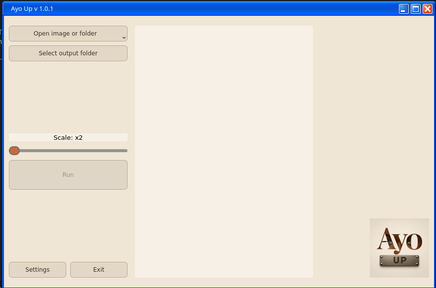
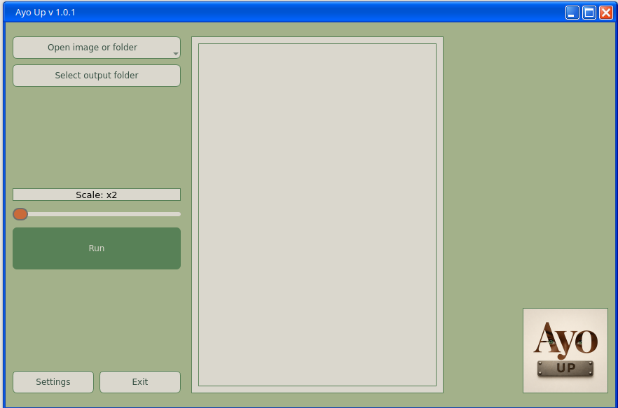

# AyoCONVERT v1.1.0

**Simple and fast batch image converter for Linux**

AyoCONVERT is a lightweight desktop application designed for quick and distraction-free image format conversion.  
Built for everyday workflows and batch processing.

Part of the **Ayo Tools** suite.

---

## ✨ Features

### 🖼️ Image conversion
Supports popular formats:
- PNG
- JPG / JPEG
- BMP
- TIFF

Additional safeguards:
- Prevents converting to the same source format
- Safe output naming using automatic suffix

---

### 📂 Batch processing
Designed to handle multiple files efficiently:

- Convert multiple images at once
- Load entire folders
- Recursive search in subfolders
- Drag & Drop support for:
  - single files
  - multiple files
  - folders

---

### 🌍 Multilingual
The application supports multiple languages and can automatically match the system locale.

Currently supported languages:
- Polish
- English
- Czech
- Slovenian
- Portuguese
- Ukrainian
- Latvian
- Lithuanian
- Estonian
- Georgian
- Spanish (from v1.1.1)

Qt system dialogs are translated automatically.

---

### 🎨 Themes
Choose the interface that fits your workflow:

- Dark theme (default)
- Light theme
- Relax theme (low-contrast green palette)
- System theme

---

### 🧠 UX focused
The interface is designed for clarity and speed:

- Clear step-by-step workflow
- Central drag & drop workspace
- Queue counter for batch jobs
- Clean interface after completion

---

## 🖼️ Screenshots

### Main window — Dark theme


### Light theme


### Relax theme


### Settings and languages


---

## 🐧 Linux-first

Developed and tested primarily on:
- Fedora
- openSUSE

Packaging planned:
- AppImage
- Flatpak
- Windows version

---

## 🚀 Run from source

### Requirements
- Python 3.10+
- PySide6
- Pillow

Install dependencies:

```bash
pip install PySide6 Pillow
