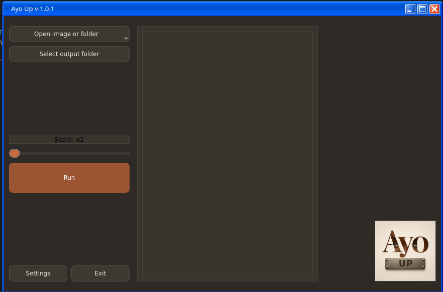
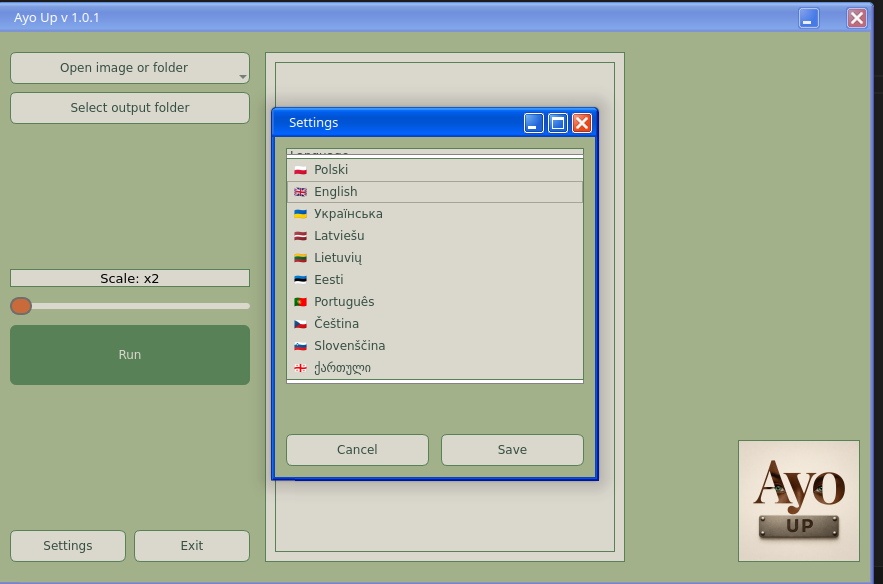

# Ayo UP

**Simple image upscaler based on waifu2x-ncnn-vulkan**

Ayo UP is a lightweight desktop application for image upscaling.  
It provides a simple graphical interface for the powerful waifu2x-ncnn-vulkan engine.

Part of the **Ayo Tools** suite.

---

## ✨ Features

### 🖼️ Image upscaling
Upscale images using the waifu2x-ncnn-vulkan engine.

Designed for:
- AI generated images
- illustrations and art
- photos and wallpapers
- batch image workflows

---

### 📂 Batch processing
The application supports processing multiple files at once:

- Select multiple images
- Load entire folders
- Recursive search in subfolders
- Drag & Drop support for:
  - single files
  - multiple files
  - folders

---

### ⚡ Modern UX

#### Fan preview widget
When multiple images are selected, the app displays a fan of random thumbnails showing the current queue.

#### Progress button
The **Run** button also acts as a progress bar during processing.

#### Smart interface behavior
- File counter appears only for multiple files
- UI clears automatically after completion
- Buttons are locked during processing to prevent errors

---

### 🎨 Themes
Choose the interface that fits your workflow:

- Dark theme (default)
- Light theme
- Relax theme (low-contrast green palette)
- System theme

---

### 🌍 Multilingual
The interface supports multiple languages and updates instantly without restart.

Currently supported languages:
- Polish
- English
- Czech
- Slovenian
- Portuguese
- Ukrainian
- Latvian
- Lithuanian
- Estonian
- Georgian

Qt system dialogs are translated automatically.

---

## 🖼️ Screenshots

### Main window


### Batch mode


### Settings


---

## 🐧 Linux-first

Developed and tested primarily on:
- Fedora
- openSUSE

---

## 🚀 Run from source

### Requirements
- Python 3.10+
- PySide6

Install dependencies:

```bash
pip install PySide6


Run the application:
python main.py
