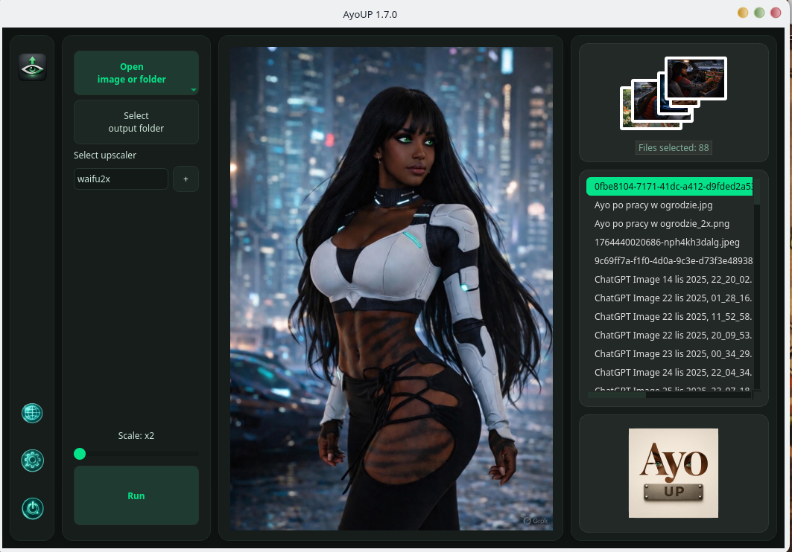
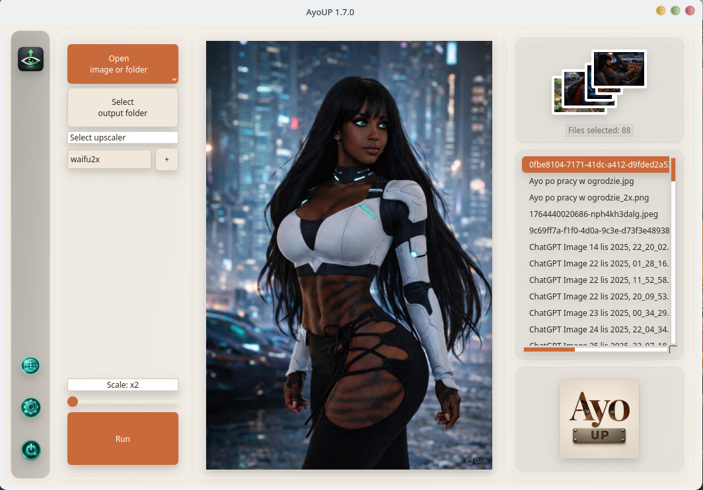
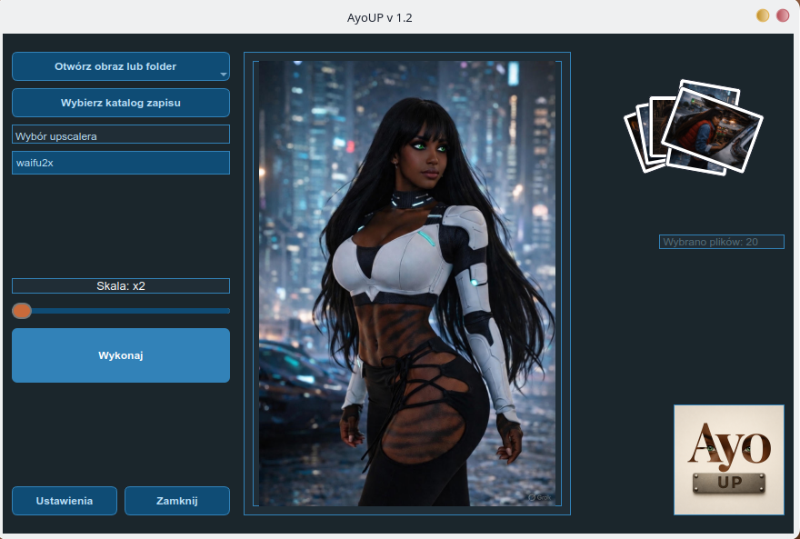
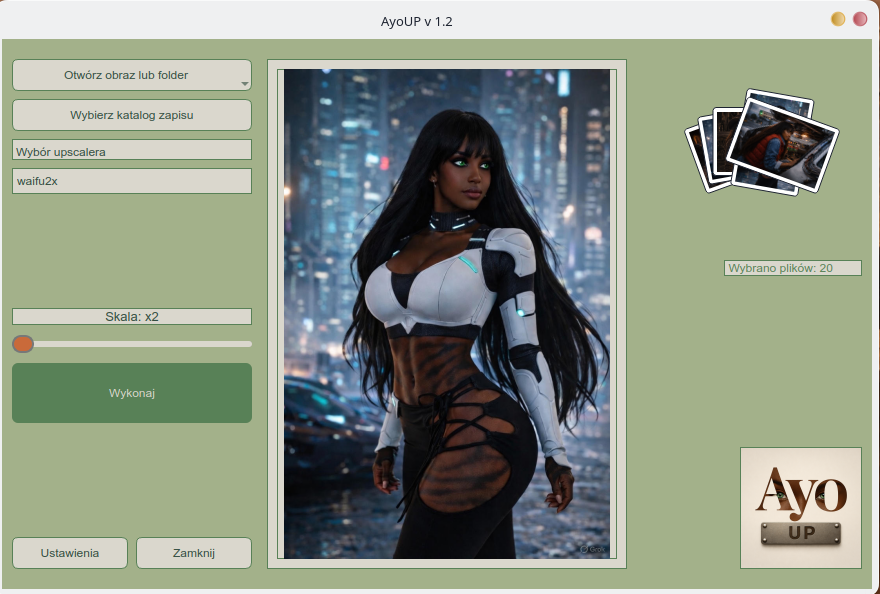
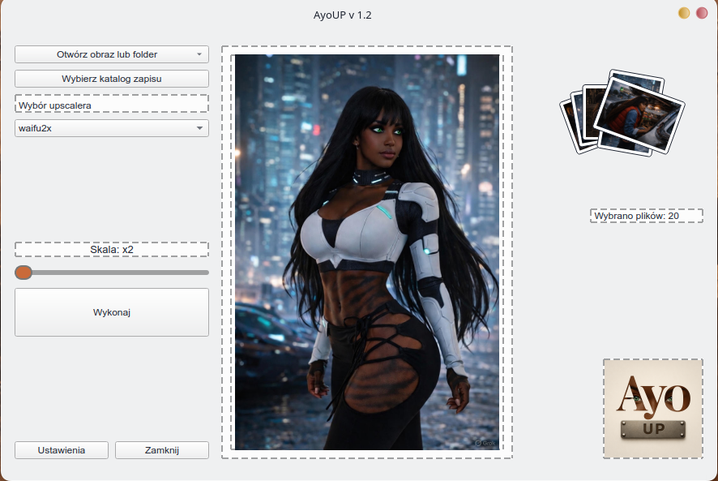
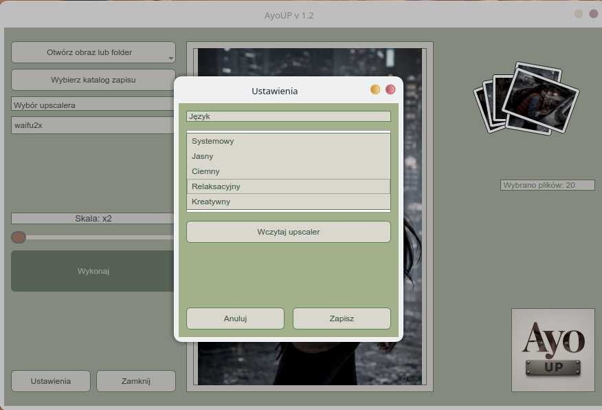
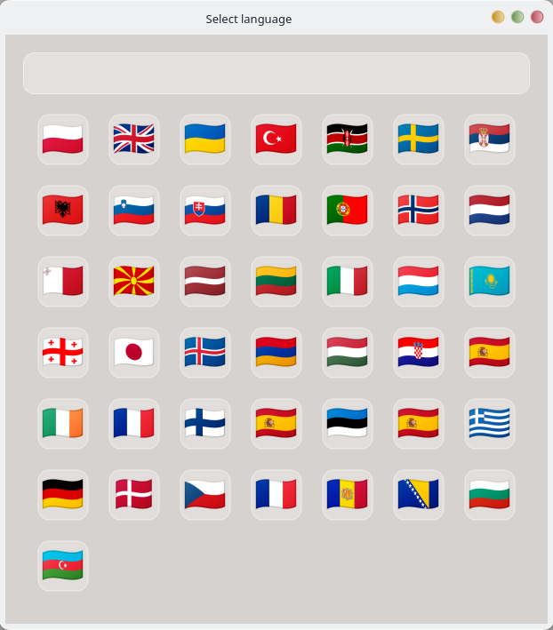

# AyoUP 1.3 – Intelligent Multi-Model Image Upscaler 🚀🖼️

AyoUP is a fast and lightweight desktop image upscaler supporting multiple **NCNN-based Vulkan engines**.

Designed for creators who need high-quality upscaling with a clean interface, flexible model management, and efficient workflow.

Part of the **Ayo Ecosystem**.

---

## 📸 Program Preview

### Main Interface Themes

| Dark Theme | Light Theme | Creative Theme | Recreational Theme | System Theme |
|:--:|:--:|:--:|:--:|:--:|
|  |  |  |  |  |

### Functional Views

| Upscaler Selection | Language Selection |
|:--:|:--:|
|  |  |

---

## 🆕 What’s New in 1.3

### 🧠 Multi-Model Upscaler Management

AyoUP is no longer limited to a single engine.

✔ **Multiple Upscaler Support**  
You can store multiple NCNN-based upscalers inside the `models` directory.  
Each model is isolated in its own folder.

📦 **ZIP Installation Support**  
Install new models directly from `.zip` archives.  
The application automatically:
- creates a folder named after the archive  
- extracts its contents  
- makes the model instantly available  

🔄 **Instant Engine Switching**  
A dropdown (`QComboBox`) in the main window allows fast switching between installed upscalers.

🏷️ **Dynamic Label Integration**  
The “Upscaler Selection” label adapts visually to the active theme.

🔁 **Automatic Model List Refresh**  
After closing the Settings window, the model list refreshes automatically if changes were made.

---

### 🌍 Expanded Language Support

Added full support for:

- 🇫🇷 French  
- 🇮🇹 Italian  
- 🇬🇷 Greek  

All translation files were updated with new keys:

- `select_upscaler`
- `filter_zip`

The interface remains fully consistent across all supported languages.

---

### 🛠 Stability & Improvements

- Fixed `ModuleNotFoundError` caused by missing translation files  
- File dialog now defaults to ZIP archives when installing models  
- Improved model refresh logic  
- Internal cleanup and stability improvements  

---

## 🚀 Key Features

### 🖼️ Flexible Upscaling Engine

AyoUP supports compatible **NCNN-based Vulkan upscalers**, including:

- waifu2x-based builds  
- Real-ESRGAN NCNN builds  
- other compatible Vulkan NCNN engines  

The application is engine-agnostic and designed for future expansion.

Perfect for:

- AI-generated images  
- digital illustrations  
- photography  
- wallpapers  
- batch workflows  

---

## 📂 Advanced Batch Processing

- Multi-file selection  
- Folder loading  
- Recursive subfolder scanning  
- Drag & Drop support (files & directories)

---

## ⚡ Modern Smart Interface

🎴 **Fan Preview System**  
Displays a dynamic fan of thumbnails when multiple files are queued.

▶️ **Smart Run Button**  
Transforms into a live progress indicator during processing.

🧠 **Intelligent UI Behavior**

- Auto-clearing interface after completion  
- Locking controls during processing  
- Context-aware file counter  

---

## 🎨 Themes

- Dark Theme  
- Light Theme  
- Recreational Theme  
- Creative Theme  
- System Theme  

All dialogs use non-native Qt rendering for full styling and localization control.

---

## 🌍 Supported Languages

- 🇵🇱 Polish  
- 🇺🇸 English  
- 🇪🇸 Spanish  
- 🇷🇴 Romanian  
- 🇵🇹 Portuguese  
- 🇺🇦 Ukrainian  
- 🇨🇿 Czech  
- 🇸🇰 Slovak  
- 🇱🇻 Latvian  
- 🇱🇹 Lithuanian  
- 🇪🇪 Estonian  
- 🇬🇪 Georgian  
- 🇫🇷 French  
- 🇮🇹 Italian  
- 🇬🇷 Greek  

The application uses an internal Qt translation layer to ensure consistent localization across systems.

---

## 🏗️ Architecture

- Modular GUI structure  
- ThemeManager styling system  
- Internal Qt translation layer  
- Multi-model management system  
- Automatic ZIP model installer  
- Non-native Qt dialogs  
- `pathlib`-based file handling  
- Clean event loop design  

---

## 🛠 Technology

- Python 3.10+  
- PySide6 (Qt for Python)  
- NCNN-based Vulkan upscalers  
- Developed on Linux (Fedora / openSUSE)

---

## 🌌 Ayo Ecosystem

- **AyoARCH** – ZIP image viewer  
- **AyoCONVERT** – file conversion tool  
- **AyoSORT** – intelligent image categorization  

More projects:  
👉 https://klucznik26.github.io/AyoWWW/

---

## 📥 Installation

### 1️⃣ Clone repository

```bash
git clone https://github.com/Klucznik26/Ayo-UP.git
cd Ayo-UP

2️⃣ Install dependencies
pip install PySide6
3️⃣ Install an Upscaler Model

You can:

place a compatible NCNN-based upscaler inside the models directory
or

install it directly from a .zip file via the application settings

4️⃣ Run application
python main.py

---

